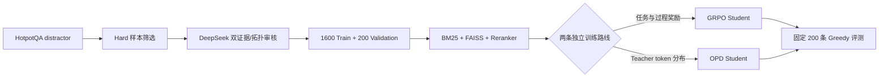

# Search-R1: GRPO vs. On-Policy Distillation for Multi-Hop Search Agents

中文 | [veRL](https://github.com/volcengine/verl) | [HotpotQA](https://hotpotqa.github.io/)

面向多跳问答搜索 Agent 的可复现实验项目：让 Qwen3-4B 学会根据问题依赖关系，在 **Bridge** 题上串行搜索，在 **Comparison** 题上同轮并行搜索，并对照 GRPO 与 On-Policy Distillation（OPD）两种训练范式。

> 本仓库基于 Apache-2.0 许可的 veRL v0.8 开发并保留所需框架源码。项目新增内容集中在 `recipe/`、Search Agent 工具链，以及 veRL 内的 SGLang 多工具调用、静态 LoRA teacher、多 teacher 路由和蒸馏损失集成。

## 项目做了什么？

传统 RAG 通常只在生成前检索一次；多跳问题还要求模型判断查询之间是否存在依赖：

| 题型 | 信息依赖 | 目标轨迹 | 行为 |
| --- | --- | --- | --- |
| Bridge | 第二跳实体来自第一跳结果 | `[1,1]` | 先查第一跳，读取工具结果，再写第二跳 query |
| Comparison | 两个查询对象都已出现在问题中 | `[2]` | 在同一轮输出两个 `search`，由运行时并行执行 |

本项目实现完整的数据、检索、训练和评测链路：



### 两条路线是对照，不是连续训练

- **GRPO 路线**：Qwen3-4B Base → 答案、召回、搜索拓扑与格式奖励 → GRPO 模型。
- **OPD 路线**：另一个 Qwen3-4B Base → student on-policy 工具轨迹 → teacher token 评分 → OPD 模型。
- GRPO/专项 checkpoint 在 OPD 中只作为 teacher 评分源；OPD student **不加载 GRPO 权重续训**。

OPD 内部实现了两种配置：

1. Bridge s75 / Compare s25 双 teacher，按题型路由，top-32 forward KL；
2. GRPO s100 单 teacher，sample-token k3，全 7 投影 LoRA。

## 实验结果

固定评测集为 200 条 HotpotQA distractor hard，包含 100 Bridge + 100 Comparison。所有结果使用 greedy 单次 rollout；Exact/F1 从预测与 gold 按统一 HotpotQA 归一化严格重算，不用 LLM judge 替代主指标。

| 模型 | Exact | F1≥0.5 | Mean F1 | Strategy | Recall | Format | Calls |
| --- | ---: | ---: | ---: | ---: | ---: | ---: | ---: |
| Qwen3-4B Base | 0.560 | 0.725 | 0.687 | 0.405 | 0.840 | 0.930 | 1.88 |
| Exact-only 50-step | 0.535 | 0.690 | 0.657 | 0.235 | 0.753 | 0.910 | 1.68 |
| **GRPO s100** | **0.590** | **0.755** | **0.720** | **0.915** | **0.878** | 0.955 | 2.07 |
| Dual-teacher OPD s100 | 0.545 | 0.700 | 0.664 | 0.855 | 0.848 | 0.915 | 2.01 |
| Sample-token OPD s25 | 0.585 | 0.745 | 0.711 | 0.780 | 0.863 | **0.965** | 2.03 |
| Sample-token OPD s100 | 0.580 | 0.735 | 0.704 | 0.865 | 0.873 | 0.945 | 2.12 |

主要发现：

- 过程奖励的主要收益是搜索策略，而不只是最终答案。GRPO s100 相比 Exact-only，Exact `+5.5 pp`，Strategy `+68 pp`。
- Comparison 的答案准确率变化不大，但正确同轮并行率显著提高；只看最终答案会漏掉这一能力。
- GRPO s100 综合最佳；继续到 s125 后 Exact/Strategy 回落到 `0.570/0.895`，因此使用固定集早停。
- sample-token OPD s25 更偏答案，s100 更偏策略：s25→s100 的 Strategy 从 `0.780` 到 `0.865`，Exact 从 `0.585` 到 `0.580`。
- 当前 OPD 答案质量接近 GRPO，但综合策略仍稍弱；这是一条有效的独立训练路线，不是 GRPO 的升级阶段。

### 分题型结果

| 模型 | Bridge Exact / Strategy | Compare Exact / Strategy |
| --- | ---: | ---: |
| Base | 0.440 / 0.630 | 0.680 / 0.180 |
| GRPO s100 | **0.510 / 0.870** | 0.670 / **0.960** |
| Dual-teacher OPD s100 | 0.420 / 0.770 | 0.670 / 0.940 |
| Sample-token OPD s100 | 0.460 / 0.830 | **0.700** / 0.900 |

Bridge 仍是主要瓶颈：第一跳实体识别、第二跳 query rewrite 和最终答案边界都会影响结果。

## 数据构建

仓库不提交 HotpotQA 原始数据、生成的 Parquet、索引、API 审核缓存或答案变体缓存。

### 1. 下载 HotpotQA distractor

```bash
python recipe/data/download_hotpotqa.py \
  --output-dir data/hotpot_qa_distractor
```

### 2. 审核真正需要双文档的 hard 样本

[`deepseek_clean_hard_data.py`](recipe/data/deepseek_clean_hard_data.py) 用两个 gold evidence documents 审核样本，并严格剔除：

- 问题本身可以直接回答；
- 单个 gold 文档足够回答；
- 不需要恰好两个 focused search；
- Bridge 不满足“第二跳实体由第一跳发现”；
- Comparison 不满足“两路搜索对象在问题中已经独立可识别”。

默认配额为 1600 条训练数据（1200 Bridge + 400 Comparison）和 200 条验证数据（各 100）。API 结果增量写入 JSONL，可中断续跑；密钥只从环境变量读取。

```bash
export DEEPSEEK_API_KEY=your_key

# 先检查候选数量，不调用 API
python recipe/data/deepseek_clean_hard_data.py --dry-run

# 正式审核与转换
python recipe/data/deepseek_clean_hard_data.py \
  --input-dir data/hotpot_qa_distractor \
  --output-dir data/hotpotqa_v3_hard_1600
```

如不使用外部审核，也可直接用规则预处理入口：

```bash
python recipe/data/data_preprocess.py \
  --input_dir data/hotpot_qa_distractor \
  --local_dir data/hotpotqa_v3_hard_1600 \
  --max_train_samples 1600 \
  --max_validation_samples 200 \
  --bridge_ratio 0.75 \
  --filter_answer_leakage
```

### 3. 构建混合索引

索引包含 SQLite FTS5/BM25、Qwen3-Embedding-0.6B FAISS 向量检索和 Qwen3-Reranker-0.6B 重排：

```bash
python recipe/data/build_hybrid_index.py \
  --train data/hotpotqa_v3_hard_1600/train.parquet \
  --validation data/hotpotqa_v3_hard_1600/validation.parquet \
  --output-dir data/hotpotqa_v3_hard_1600/hybrid_index
```

若需要从 HotpotQA DatasetDict 或官方 Wikipedia `.bz2` 构建全局 SQLite 语料库，使用 [`build_hotpotqa_db.py`](recipe/data/build_hotpotqa_db.py)。

## 训练方法

### 环境

实验环境：Linux、Python 3.12、CUDA 12.8、PyTorch 2.9.1、SGLang 0.5.8、FlashAttention 2.8.3、FlashInfer、Ray 2.56.1、PEFT 0.18.0。主实验使用 Qwen3-4B，全 7 投影 LoRA：

```text
q_proj, k_proj, v_proj, o_proj, gate_proj, up_proj, down_proj
rank=32, alpha=64
```

克隆代码并创建基础环境：

```bash
git clone https://github.com/GGBo1350/my_search_r1.git
cd my_search_r1

uv venv --python 3.12
source .venv/bin/activate
uv pip install -e ".[sglang]"
uv pip install -r requirements.txt
```

在已有 veRL 环境上切换到项目验证过的 SGLang 依赖：

```bash
bash scripts/setup_search_r1_sglang.sh
```

该脚本会在修改前记录环境快照。请先阅读脚本并按机器调整 `ENV_DIR`、CUDA/PyTorch 版本及缓存路径。

### GRPO

正式配置训练 125 step，每 25 step 保存，并在固定集上选择 s100：

```bash
MODEL_PATH=/path/to/Qwen3-4B \
ARTIFACT_ROOT=/path/to/artifacts \
PROJECT_ROOT=$PWD \
TRAINER_LOGGER='["console"]' \
bash recipe/phase1/run_sglang_train_4b_full_lora_125step_939.sh
```

启动脚本中的机器编号只用于标记原始实验，不影响逻辑；路径和 logger 均可用环境变量覆盖。

复合奖励位于 [`recipe/core/my_reward.py`](recipe/core/my_reward.py)，包括答案 F1/Exact、gold title recall、Bridge/Comparison 拓扑、格式，以及重复/过度搜索约束。至少一次成功检索后才开放答案分，减少模型绕过工具直接依赖参数记忆。

### 双 teacher OPD

```bash
STUDENT_MODEL=/path/to/Qwen3-4B \
BRIDGE_TEACHER_ADAPTER=/path/to/bridge_s75/lora_adapter \
COMPARE_TEACHER_ADAPTER=/path/to/compare_s25/lora_adapter \
bash recipe/phase2/run_mopd_bridge_compare_2gpu_931.sh
```

样本通过顶层 `teacher_route=bridge|compare` 路由。旧 Parquet 可用 `add_teacher_route.py` 转换，并用 `verify_opd_routes.py` 校验。

### Sample-token k3 OPD

```bash
BASE_MODEL=/path/to/Qwen3-4B \
TEACHER_ACTOR_CHECKPOINT=/path/to/grpo_s100/actor \
ARTIFACT_ROOT=/path/to/artifacts \
TRAINER_LOGGER='["console"]' \
bash recipe/phase2/run_opd_phase1_s100_sample_token_1gpu_805.sh
```

该路线关闭 task reward 与 policy-gradient distillation，teacher 只返回 student 实际采样 token 的 log-prob，并以 k3 reverse-KL 样本估计直接反传。脚本会校验 teacher/student 均覆盖全 7 投影。

### 双 teacher Reverse Top-32 OPD

```bash
STUDENT_MODEL=/path/to/Qwen3-4B \
TEACHER_BASE_MODEL=/path/to/Qwen3-4B \
BRIDGE_TEACHER_ADAPTER=/path/to/bridge_s75/lora_adapter \
COMPARE_TEACHER_ADAPTER=/path/to/compare_s25/lora_adapter \
TRAIN_FILE=/path/to/train_opd_routed.parquet \
TEST_FILE=/path/to/validation_opd_routed.parquet \
bash recipe/phase2/run_mopd_bridge_compare_reverse_top32_2gpu.sh
```

当前 teacher 服务不能按每个位置的 student Top-k ID 任意查询概率，因此该实现使用 teacher Top-32 token 加一个聚合剩余词表概率的 `other` 桶，在这个共享的 33 类支持集上计算 `KL(student || teacher)`。它是有效的粗粒度 Reverse KL，不是完整词表 Reverse KL，也不同于单采样 token 的 k3 估计和 `OPD-main` 中由本地全 logits teacher 支持的 `only_stu` 实现。

## 评测

固定 200 条 greedy 评测：

```bash
TARGET_STEP=100 \
CHECKPOINT_DIR=/path/to/checkpoints/run_name \
MODEL_PATH=/path/to/Qwen3-4B \
TEST_FILE=./data/hotpotqa_v3_hard_1600/validation.parquet \
TOOL_CONFIG_PATH=recipe/core/tool_config_hybrid.yaml \
bash recipe/eval/run_fixed200_after_training.sh
```

五 checkpoint 串行评测与汇总：

```bash
CHECKPOINT_DIR=/path/to/checkpoints/run_name \
bash recipe/phase1/run_eval_full_lora_checkpoints_805.sh
```

分析脚本：

- `recipe/phase1/analyze_full_lora_checkpoints.py`：五个 checkpoint 的 Overall/Bridge/Compare 严格指标；
- `recipe/phase1/analyze_phase1_comparison.py`：Base、Exact-only、正式模型的逐题差异；
- `recipe/eval/compute_passk.py` / `report_passk.py`：sampled pass@k 与策略报告；
- `recipe/phase2/validate_opd_checkpoints.py`：OPD LoRA 完整性检查。

## 核心实现

- **批量工具调用解析**：同时支持自定义 `<tool_calls>` 和 Qwen 原生连续 `<tool_call>`；
- **并行搜索执行**：同一 assistant turn 的多个 search 并发执行并保留调用分组；
- **混合检索**：SQLite FTS5/BM25 + FAISS + Reranker；
- **题型可计算策略指标**：Bridge `[1,1]`、Comparison `[2]`；
- **静态 LoRA teacher**：SGLang 加载 base + adapter，teacher 只评分不生成；
- **多 teacher 路由**：根据样本 `teacher_route` 选择 teacher；
- **两种蒸馏目标**：top-k forward KL 与 sample-token k3；
- **共置显存治理**：teacher/rollout sleep 与 KV cache 释放、并发限制、独立 GPU memory utilization；
- **严格 checkpoint 选择**：不按最后一步或训练 loss 选模型。

## 仓库结构

```text
recipe/
  core/            搜索工具、XML/原生工具调用解析、复合奖励
  data/            下载、清洗、Parquet 转换、SQLite/FAISS 索引
  eval/            固定 200 条与 pass@k 评测
  phase1/          GRPO 训练、五 checkpoint 评测与分析
  phase2/          Teacher 训练/导出/校验、双 teacher 与 sample-token OPD
  train_lora/      共享 LoRA + SGLang 训练入口
verl/              veRL v0.8 源码及本项目所需 AgentLoop/OPD 扩展
tests/recipe/       搜索工具、奖励、数据和多 teacher 共置测试
docs/               veRL 上游文档与项目补充说明
```

Checkpoint、模型权重、原始/清洗数据、索引、rollout、日志、SwanLab/W&B 缓存均由 `.gitignore` 排除。

## 测试

```bash
pytest -q tests/recipe/test_v3.py tests/recipe/test_search_r1_mopd_colocation.py
```

GPU 端到端训练仍需按实际 CUDA、SGLang、FlashInfer 和显存条件验证；公开仓库不附带模型权重或训练机器环境。

## 局限

- 当前固定评测集只有 200 条，适合受控 checkpoint 比较，但不足以证明外部泛化；
- OPD 两种实现同时改变了 teacher、硬件和 token 目标，不能作为严格的 loss 单变量消融；
- Bridge Exact 仍明显低于 Comparison，第二跳 query 与答案抽取仍是瓶颈；
- DeepSeek 只用于数据审核和可选答案变体构造，主评测不依赖 LLM judge；
- 训练脚本来自实际实验快照，部分默认路径需要按机器覆盖。

## 致谢与许可

本项目建立在以下开源项目与数据之上：

- [veRL](https://github.com/volcengine/verl)
- [Search-R1](https://github.com/PeterGriffinJin/Search-R1)
- [SGLang](https://github.com/sgl-project/sglang)
- [Qwen3](https://github.com/QwenLM/Qwen3)
- [HotpotQA](https://hotpotqa.github.io/)

仓库沿用 veRL 的 Apache License 2.0，详见 [`LICENSE`](LICENSE) 与 [`Notice.txt`](Notice.txt)。仓库页面组织参考了 [shopping-grpo-longhorizon](https://github.com/YYHDBL/shopping-grpo-longhorizon) 的可复现项目呈现方式。
